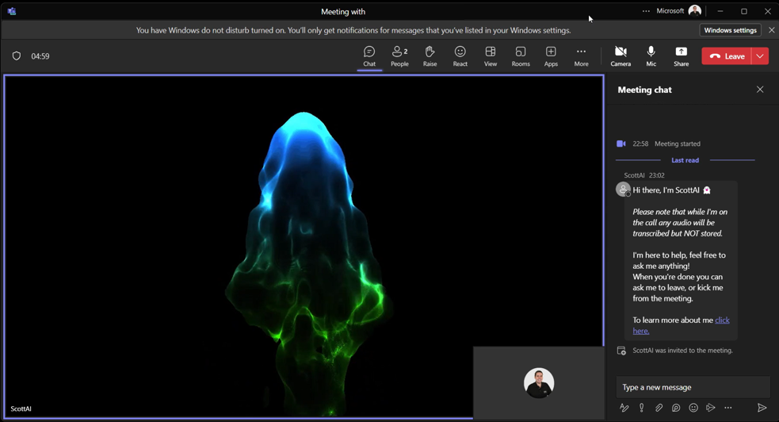
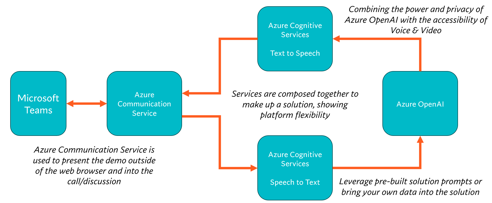
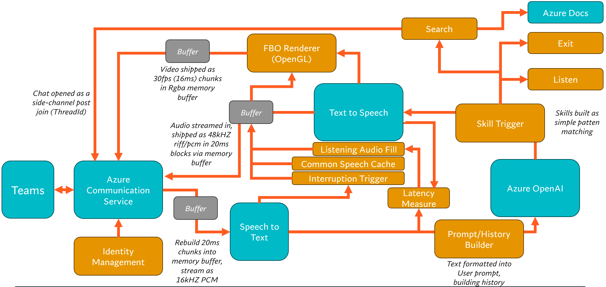

# ScottAI
Inviting Large Language Models to be part of our conversations.

_Note: The name ScottAI is only temporary, it may/will change at any time_

**This project is currently finishing up a major refactor, apologies for the spaghetti code that is yet to be cleaned up!**

## What is ScottAI?

- A bot that is invited into a conversation (in this demo, a Teams call)
- Given a virtual voice and virtual webcam so it can interact with others
- Access to multiple knowledge sources & skills, and can be extended for different use cases
- Voice, Video, and Chat access, allowing for multiple channels to be leveraged at once

## Getting Started
**Note: The entry point in this repo is in the [ScottAIPrototype.Console](ScottAIPrototype.Console/) folder**
1. Clone or download this repo
1. Deploy the Bicep or ARM template located in the [deploy](deploy/) folder. Eg: `az deployment group create -g myResourceGroup -f deploy/deploy.bicep`
1. Update the ScottAIPrototype.Console [appsettings.json](ScottAIPrototype.Console/appsettings.json) using the values from the resources deployed.
1. Update the [meeting.txt](ScottAIPrototype.Console/meeting.txt) file with a link to a teams meeting. This file should contain the URL and nothing else.
1. Start ScottAI using Visual Studio, VSCode, or the following command within the [ScottAIPrototype.Console](ScottAIPrototype.Console/) folder: `dotnet run --runtime win10-x64 --no-self-contained -c Release`
1. ScottAI should join the call once started, if you have the meeting not set to auto-accept guests it will prompt to accept once in the lobby.

## Single-Click Deploy for Azure Resources
_To add_

## High-Level Architecture

## Architecture

## FAQ
- What�s up with the virtual webcam image? _This started as a technical demo, and while this is currently a placeholder, it is designed to demonstrate how personality can be shown through real-time rendering._
- How does the skill engine work? / Can it do X? _There is a very simple low-latency skill trigger system within the code that can be extended to interact with any data, API, or anything you can code. It is also designed so more complex frameworks like Semantic Kernel can be swapped in._
- I can't get it to run/it crashes! _Check the getting started guide, there is a specific runtime required for the native dependencies._